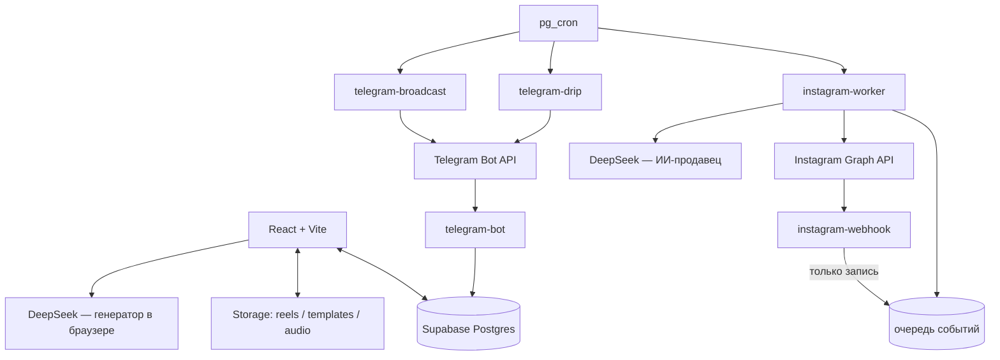

# ViralReel AI Studio — архитектура

Платформа делает три вещи: генерирует и рендерит Instagram Reels, превращает комментарии под ними в лиды (Comment-to-DM), и доводит этих лидов в Telegram, где ограничение Instagram на переписку не действует.

---

## 1. Секреты и ключи

Самый важный раздел, и раньше он был описан неверно — здесь актуальное состояние.

**Ключ DeepSeek живёт в двух местах, и это осознанно:**

- **В браузере** (`localStorage`, ключ `deepseek_api_key`) — им пользуется генератор хуков и описаний. Запросы уходят из браузера пользователя напрямую в DeepSeek, сервер их не видит.
- **На сервере в зашифрованном виде** (`user_ai_credentials.deepseek_api_key_encrypted`, AES-GCM) — им пользуется ИИ-продавец, отвечающий в Direct. Он работает без открытого браузера, поэтому ключ обязан быть доступен Edge Function.

Утверждение «ключ не передаётся на сервер» **неверно** с тех пор, как появился ИИ-продавец. Ключ передаётся один раз через функцию `deepseek-credential`, шифруется и обратно в браузер не возвращается — интерфейс может только заменить его или удалить.

**Токен Telegram-бота** (`telegram_bots.bot_token_encrypted`) шифруется той же схемой. Колоночные гранты запрещают роли `authenticated` читать его и `webhook_secret` вовсе, поэтому `select *` по этой таблице из браузера падает по правам — клиент обязан перечислять колонки явно.

**Токен Instagram** (`instagram_accounts.access_token`) закрыт тем же способом с миграции `20260814120500`.

**Ключ шифрования** — секрет `CREDENTIALS_ENCRYPTION_KEY` в Edge Functions. Без него не подключается ни ИИ-продавец, ни бот.

**Модели:** `deepseek-v4-pro` в браузере (`services/ai/deepseekClient.ts`), `deepseek-v4-flash` на сервере (`_shared/sales-agent.ts`) — там важнее скорость ответа в диалоге.

---

## 2. Хранилище

Все бакеты приватные, доступ только по краткосрочным подписанным ссылкам:

- **`reels`** — отрендеренные ролики;
- **`templates`** — исходные видеоподложки;
- **`audio`** — музыка и звуковые эффекты;
- **`funnel-media`** — вложения сообщений: файлы шагов воронки, рассылок и лид-магнитов.

Браузер подписывает на час, отправщики — на два: Telegram и Meta забирают файл в момент отправки, а отправка может случиться через неделю после загрузки, поэтому ссылку минтит воркер под сервисной ролью, а не редактор при сохранении. Ничего долгоживущего в бакет не ссылается.

`funnel-media` отличается от остальных ещё двумя вещами: политики ограничивают доступ собственной папкой пользователя на всех глаголах (в остальных бакетах читать может любой аутентифицированный — так было нужно рендереру), и у него выставлен `file_size_limit` в 20 МБ, потому что лимиты редактора живут в браузере и защитой не являются.

---

## 3. Instagram: очередь, а не обработка в вебхуке

Ключевое архитектурное решение. Вебхук **ничего не обрабатывает**: проверяет подпись, записывает события и отвечает 200. Всё остальное делает `instagram-worker` раз в минуту.

Так сделано потому, что залетевший Reels приносит комментарии всплеском, а Edge Function живёт 150 секунд. Прежняя версия обрабатывала события по очереди со сном перед каждым ответом, и остаток пачки терялся **безвозвратно**: строки уже записаны, повтор от Meta отсекался уникальным индексом.

Как устроен воркер:

1. **Захват** через SQL-функцию `claim_instagram_events` с `FOR UPDATE SKIP LOCKED`. PostgREST не умеет ни `UPDATE ... LIMIT`, ни инкремент, а «выбрать, потом обновить» оставляет окно, где два тика берут одно событие — то есть человек получает лид-магнит дважды.
2. **50 событий за тик.** Размер подобран под лимит CPU в 2 секунды, а не под wall-clock: тик, вышедший за CPU, убивается и оставляет захваты висеть. 50 в минуту — это 3000 в час.
3. **Задержка ответа** — это `next_attempt_at`, а не сон. Ждать бесплатно.
4. **Часовой лимит 700 отправок** на аккаунт, ниже метовских 750. Считается по времени отправки, а не прихода: при заторе это разные вещи.
5. **Предохранитель**: один ответ «слишком часто» снимает аккаунт с отправки до конца тика — он относится ко всему аккаунту, а не к одному сообщению.
6. **Ретраи** с экспоненциальной паузой. Закрытый инбокс и истёкшее окно 24 часов не ретраятся: это сожгло бы квоту впустую.

Защита от повторной выдачи — настройка `repeat_delay_hours` плюс частичный уникальный индекс на `(правило, отправитель, дата)` как страховка от гонки.

Состояние очереди видно в интерфейсе: представление `instagram_queue_health` и полоска над вкладками автоматизаций, которая молчит, пока всё в порядке.

---

## 4. Telegram: воронки, курсы, рассылки

Instagram разрешает писать человеку только 24 часа после его сообщения. Подписчик Telegram доступен всегда — поэтому кнопка в Direct ведёт в бота.

**Атрибуция** — смысл всей связки. Ссылка несёт `?start=<slug>_<automation_event_id>`, бот раскладывает её обратно и записывает событие на подписчика. Поэтому видно, какое кодовое слово под каким Reels привело каждого. Payload публичный, так что вебхук проверяет, что событие принадлежит владельцу бота — иначе чужой мог бы испортить вашу статистику.

**Воронка** — это приветствие, необязательная проверка подписки на канал и дальше **последовательность шагов** с задержками. Один шаг = одно сообщение. Так одна воронка выдаёт лид-магнит, а другая ведёт недельный курс.

Шаги с нулевой задержкой уходят прямо в вебхуке — чат, сказавший «держите материал» и замолчавший на минуту, читателя уже потерял. Остальные доставляет `telegram-drip`, продвигая подписчика на шаг за тик. Уникальный индекс `(подписчик, шаг)` гарантирует, что урок не придёт дважды; строка доставки создаётся **до** отправки, поэтому падение означает урок с опозданием, а не потерянный.

**Рассылки** (`telegram-broadcast`) материализуют аудиторию в очередь при старте и шлют ~25 сообщений в секунду. Убитый воркер теряет только сообщение в полёте. Сегмент аудитории описан данными в `_shared/broadcast-segments.ts`, и композер с воркером читают одно и то же описание — иначе показанное число получателей и реальная выборка разошлись бы.

---

## 5. Планировщик

Все фоновые задачи ходят в Edge Functions через `invoke_edge_function`, которая берёт адрес проекта и секрет из **Supabase Vault**.

Так сделано не от хорошей жизни: раньше задачи читали `current_setting('app.settings.…')`, а задать эти настройки по инструкции невозможно — на Supabase роль `postgres` не суперпользователь, и `ALTER DATABASE ... SET` отклоняется. В результате все задачи молча падали, а ошибки были видны только в `cron.job_run_details`, куда никто не смотрит. Функция теперь падает с внятным сообщением, если секретов нет.

Расширение `pg_net` включается миграцией — без него `net.http_post` не существует и не работает ни одна задача.

---

## 6. Тесты

`npm test` — типы, сверка `full_schema.sql` с миграциями, юнит-тесты, сборка.

Тесты покрывают чистые модули в `supabase/functions/_shared/`, которые импортируют и браузер, и Edge Functions: разбор deep-link, сегменты рассылок, арифметика последовательности шагов. Эти модули намеренно без зависимостей — поэтому одинаково загружаются в Deno, в браузерном бандле и в Node под Vitest, и правило существует ровно в одном экземпляре.

**Не покрыто:** сопоставление кодовых слов (`matchesKeyword`), интерфейс, сами Edge Functions.
